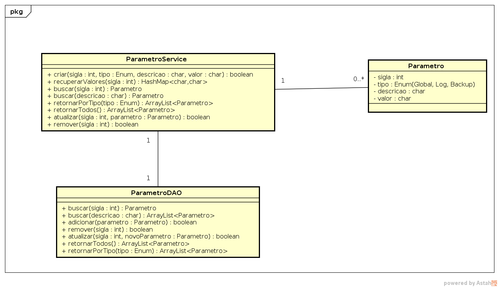
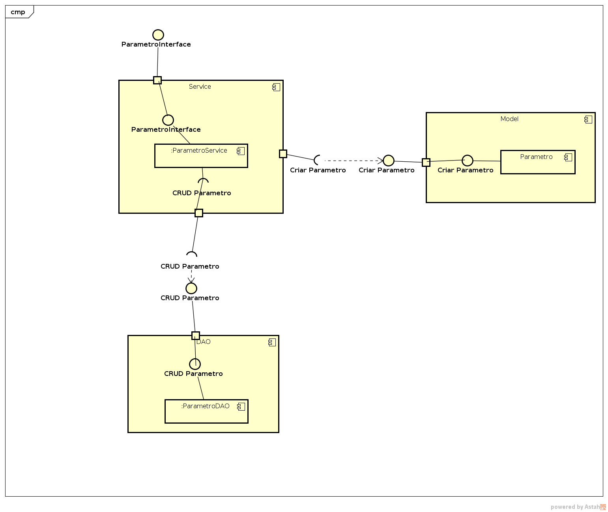
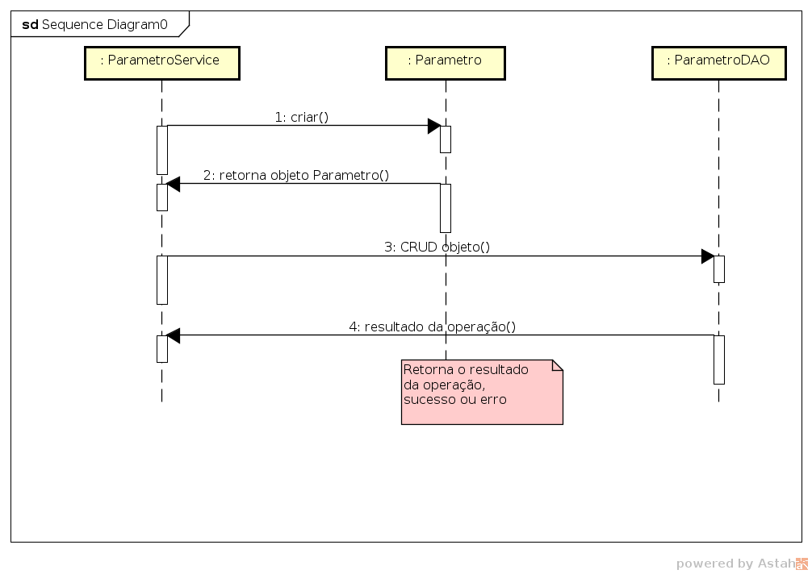

Exemplos de Diagramas e Protótipos
======================================
Repositório contendo alguns artefatos de minha autoria durante a graduação

1. Diagramas
-----------------  

#### 1.1 Diagrama de classes  
  

#### 1.1 Diagrama de componentes
  

#### 1.1 Diagrama de sequencia
  

2. Protótipos
----------------

[Storyboard do requisito Atualizar Egresso](Protótipos/AtualizarEgresso/RF-AtualEgres-Storyboard.md)
